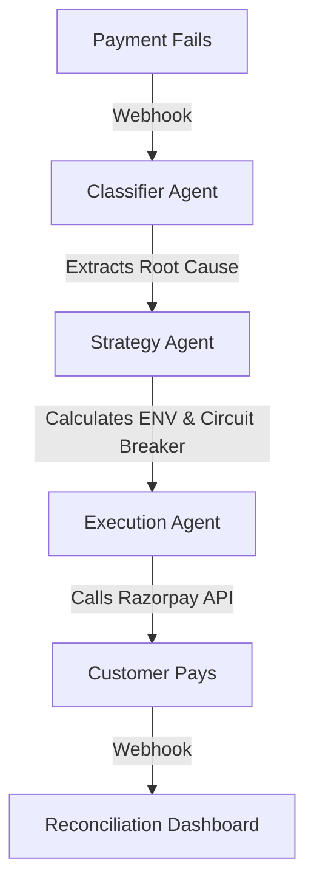

# Revenue Recovery Agent

An autonomous payment recovery engine designed to maximize recovered revenue through probabilistic intervention modeling, while enforcing strict non-circular circuit breakers against fraudulent or unsafe retries.

Built with Node.js, Express, PostgreSQL, and native integrations with the Razorpay API and Gemini 2.5 Flash.

---

## Overview
Traditional payment recovery relies on blind retry loops, leading to higher chargeback rates, flagged merchant accounts, and frustrated users. 

This system replaces static rules with an autonomous pipeline that evaluates the root cause of a failure and calculates the Expected Net Value (ENV) of an intervention. The agent executes recovery actions (e.g., dynamic discount links, nudges, retries) only when the mathematical probability of recovery outweighs the intervention cost.

## Architecture

The system is strictly decoupled to prevent AI hallucination in financial decision-making.



1. **Classifier**: Ingests failure codes and context, resolving them to true root causes (e.g., `insufficient_funds`, `unrecoverable_fraud`, `transient_error`).
2. **Strategy Engine**: Calculates recovery probability against intervention cost. Determines the optimal path to maximize ENV.
3. **Safety Circuit Breaker**: Enforces a strict daily intervention budget. If the threshold is breached or a transaction is flagged as high-risk, the system hard-stops and escalates to a human operator.
4. **Execution**: Interfaces with Razorpay's API to generate and dispatch dynamic payment links.

## Dashboard & Telemetry
The repository includes a real-time React dashboard (Vite) for complete telemetry over the agent's decisions.
- **KPI Aggregation**: Tracks revenue at risk, verified recovered revenue, and blocked transactions.
- **Intervention Analytics**: Measures the financial yield of specific recovery strategies.
- **Audit Log**: A persistent Postgres ledger recording the exact reasoning and math behind every AI decision.

## Tech Stack
- **Backend**: Node.js, Express, TypeScript, Prisma (PostgreSQL)
- **Frontend**: React, Vite, Custom CSS
- **AI**: Gemini 2.5 Flash
- **Payments**: Razorpay API & Webhooks

## Quickstart

1. **Install dependencies**
   ```bash
   npm install
   ```

2. **Environment Configuration**
   Copy `.env.example` to `.env` and provision the required keys:
   - Razorpay API credentials and webhook secret
   - Gemini API key
   - PostgreSQL connection string
   - `ADMIN_API_SECRET` (Required for mutative operations)

3. **Database Initialization**
   ```bash
   npx prisma db push
   npm run generate-data
   ```

4. **Run Services**
   ```bash
   # Terminal 1: Backend
   npm run api
   
   # Terminal 2: Dashboard
   cd dashboard && npm run dev
   ```

## Security
All mutative endpoints (overrides, webhook simulations) require Bearer token authentication via `ADMIN_API_SECRET`. The dashboard inherits this from the environment configuration. Deployment without this secret will lock down all state-changing operations.

## Evaluation & Efficacy
The agent's decision matrix is continuously evaluated against an independent, decoupled ground-truth Monte Carlo simulation (`npm run evaluate`). 

In a benchmark of 10,000 synthetic transactions, the agent successfully blocked 100% of risky/fraudulent retries compared to a naive retry baseline, achieving a 0% unnecessary retry rate while maximizing safe recovered revenue.
