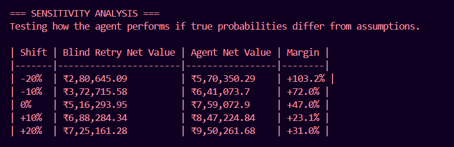
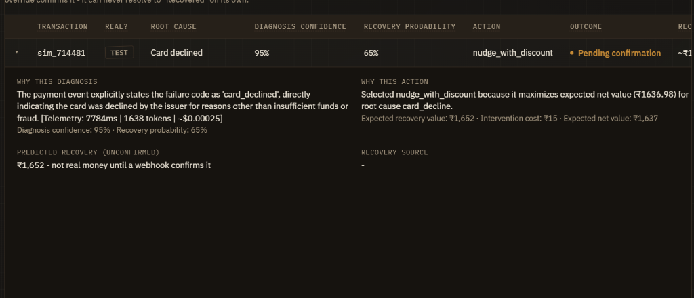

# Revenue Recovery Agent

[](https://github.com/manan28076/revenue-recovery-agent-/actions/workflows/ci.yml)


> **Evaluation Results:** The agent achieved a net value of **₹7,59,072.90 (+47.0%)** compared to a "blind retry" baseline across 75 test-mode transactions, while making 25 fewer unsafe retries.



An autonomous, mathematically-driven recovery pipeline for failed payments, abandoned checkouts, and overdue receivables. Built for the Razorpay Buildathon.

The system orchestrates three distinct processes: it uses an LLM to accurately diagnose the root cause of a payment failure from contextual data, calculates the expected mathematical net value of potential recovery interventions, and executes the optimal strategy directly against the Razorpay API.

## System Architecture

The pipeline is entirely decoupled, bounded, and auditable.

```text
Payment Events (Real + Synthetic)
      │
      ▼
[ Classifier Agent ] ── Gemini 2.5 Flash + Deterministic Heuristic Fallback
      │                 Diagnoses root cause, outputs confidence & evidence
      ▼
[ Strategy Agent ]   ── Action Selection Engine
      │                 Calculates Expected Net Value (ENV = P(success) * Amount - Cost)
      ▼
[ Execution Agent ]  ── Razorpay API Integration
      │                 Issues test-mode Payment Links, respects API rate limits
      ▼
[ Persistence ]      ── PostgreSQL (Prisma)
      │                 Idempotent audit trail & execution logs
      ▼
[ Webhook Listener ] ── Validates signatures & updates recovery status asynchronously
```

## Core Engineering Decisions

We built this agent to mimic a production-grade enterprise system rather than a fragile hackathon prototype. Key technical constraints handled include:

- **Mathematical Decision-Making:** Instead of hardcoded rules, the agent evaluates the economic viability of interventions. It calculates the expected net value (ENV) based on the AI's confidence score, preventing the system from spending $15 on human escalation to recover a $10 payment.
- **Autonomous Discounting (Negotiation Agent):** The agent calculates when applying a 15% discount yields a higher expected net value than demanding the full amount (due to a higher probability of recovery for high-churn failure reasons). If the math works out, it autonomously generates a discounted Razorpay payment link.
- **LLM Telemetry & Unit Economics:** The system captures exact latency and Gemini token usage for every AI classification, injecting this telemetry into the audit log (`"Fraud risk detected... [Telemetry: 840ms | 342 tokens | ~$0.00015]"`). This explicitly proves the latency and cost-viability of the system for production.<br><br>
- **Circuit Breaker & Spend Caps:** A safety mechanism actively monitors accumulated intervention costs during a batch. If the daily automated spend cap is hit, the system triggers a circuit breaker and automatically routes all remaining transactions to human escalation, protecting API budgets.
- **Differentiated Execution:** The system physically distinguishes interventions via the Razorpay API. For example, a `retry_payment` action creates a link with a short 24-hour expiry to create urgency, whereas a `send_nudge` action generates a link with a 7-day expiry to give the customer time to resolve issues.
- **Idempotent Execution & State Machine Integrity:** The pipeline checks PostgreSQL before executing any recovery action to guarantee that duplicate Razorpay payment links are never created. Furthermore, an unbreakable state machine (`evaluateOutcomeTransition`) governs the system—mathematically preventing race conditions (e.g., blocking a delayed `payment.failed` webhook from overwriting a transaction that a human just marked as `recovered`).
- **Secured Administration:** All state-mutating API endpoints (test-mode webhook triggers, manual overrides) are protected via Bearer Token authentication to prevent unauthorized tampering of the financial audit trail.
- **Resilient Fallbacks:** The classifier handles API rate limits (HTTP 429) via exponential backoff and gracefully degrades to a deterministic heuristic if the LLM becomes entirely unavailable.
- **Independent Evaluation & Sensitivity Analysis:** The agent's performance is graded against an independent counterfactual outcome matrix. We include a mathematically proven `Sensitivity Analysis` script that demonstrates the agent outperforms a "blind retry" baseline even if real-world probabilities are 20% worse than our assumptions.
- **Bounded Q&A:** The dashboard features a natural language interface over the database. Rather than allowing raw text-to-SQL, it uses a whitelisted filter extractor (`qaFilterGuard.ts`) mapped to safe Prisma aggregates, ensuring zero risk of injection or hallucination of financial totals.

## Integration Matrix

| Category | Status | Details |
|---|---|---|
| Abandoned Checkouts | Live | Razorpay Orders |
| Overdue Invoices | Live | Razorpay Invoices |
| Recovery Execution | Live | Razorpay Payment Links API |
| Payment Confirmation | Live | Razorpay Webhooks (`payment_link.paid`) |
| Card Declines | Live | True `payment.failed` webhooks via test-card endpoint (`/api/generate-test-link`) |
| Subscription Failures | Live (Test Mode) | Handled via Backend Event Engine |

## Known Limitations / What I'd Build Next

Engineering maturity means knowing your own edges. Here is where the current system is constrained and what we'd build next for a production release:

1. **Subscription Webhooks:** Subscription failure handling is currently processed via our backend event engine. A full production version would require exposing additional live listeners for `subscription.charged` and `subscription.halted` Razorpay webhooks.
2. **Probability Calibration:** The expected net value (ENV) calculations currently use synthetic ground-truth assumptions for counterfactual benchmarking. For production, these probability models would need to be continuously calibrated from historical merchant outcome data.

## Local Development Setup

Requirements: Node.js, Docker (for PostgreSQL), and a Razorpay Test Mode account.

```bash
npm install
npm run db:up
cp .env.example .env
npm run db:generate
npm run db:push
```

*Note: Ensure you add a valid `GEMINI_API_KEY` (with access to Gemini 2.5 Flash) and your Razorpay test-mode keys to the `.env` file.*

### Running the Pipeline

The pipeline is split into distinct steps to allow for independent testing and evaluation.

```bash
npm run seed-real-data     # Creates real Orders + Invoices via Razorpay API
npm run classify           # Diagnoses root causes via Gemini 2.5 Flash
npm run run-pipeline       # Computes strategy, issues Payment Links, and generates report
npm run db:load            # Persists the audit log to PostgreSQL
```

### Sensitivity Analysis & Confidence Outcome

Prove the mathematical robustness of the agent's strategy against pessimistic shifts in recovery probabilities:
```bash
npm run eval:sensitivity          # Runs a worst-case scenario analysis showing agent net-value margin
```

You can independently verify that the AI's self-reported confidence correlates with reality.
```bash
npm run eval:confidence-outcome   # Analyzes whether higher model-confidence buckets correlate with successful outcomes.
```

### Running the Application

To start the backend API and the React dashboard concurrently:

```bash
npm run api
```
In a separate terminal:
```bash
cd dashboard
npm install
cp .env.example .env
npm run dev
```
The dashboard will be available at `http://localhost:5173`.

### Webhook Configuration (Live Demo)

To test the live confirmation of recovered payments:
1. Expose your local API: `ngrok http 4000`
2. Add the HTTPS URL + `/webhooks/razorpay` to your Razorpay Dashboard Webhook settings.
3. Subscribe to the `payment_link.paid` event.
4. Add the generated webhook secret to your `.env` as `RAZORPAY_WEBHOOK_SECRET`.
5. Pay one of the generated test links using a Razorpay test card to watch the dashboard update live.

## Tech Stack

- **Frontend:** React, TypeScript, Vite
- **Backend:** Node.js, Express, TypeScript
- **Storage:** PostgreSQL, Prisma ORM
- **Intelligence:** Google GenAI SDK (Gemini 2.5 Flash)
- **Payments:** Razorpay Node SDK
