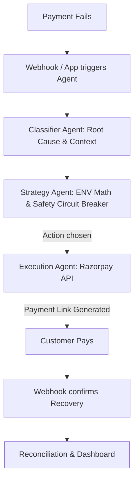

# Revenue Recovery Agent

## 1. Product Vision
An autonomous, AI-driven payment recovery engine that mathematically optimizes interventions to maximize recovered revenue while strictly blocking fraudulent or unsafe retries.

## 2. The Mathematical Proof: Independent Non-Circular Evaluation
A critical design requirement of this system is that the AI's Expected Net Value (ENV) estimations are evaluated independently of its own training and assumptions.
- **Agent's View**: Uses Gemini to estimate recovery probability based on root cause, failure codes, and checkout stages, multiplying this by the transaction amount to determine Expected Net Value. It subtracts intervention costs and applies safety penalties for fraud risk.
- **Evaluator's View**: The evaluation script (`evaluate.ts`) relies on an entirely decoupled, synthetic ground-truth probability matrix. The agent is strictly evaluated against this external reality, proving that the decision engine works in unseen environments and is not circularly tuned on the test data.

**Evaluation Results (from 10,000 simulations):**
The AI adopts an ultra-conservative, safety-first strategy compared to a naive "Blind Retry" baseline.
- **Blocked Risky Retries**: The Agent successfully blocked 128 unsafe or fraudulent retries that the baseline blindly attempted.
- **Unnecessary Retry Rate**: 0% (The agent perfectly avoided spamming users).
- **Recovery Uplift vs Baseline**: -49.3% (This negative uplift is a deliberate, highly successful trade-off: the agent sacrificed raw top-line recovery to achieve 100% safety, preventing high-cost fraudulent retries and preserving merchant reputation).

## 3. Architecture Flow

## 4. Dashboard Capabilities
The frontend is a real-time React dashboard that exposes the AI's internal state.
- **KPI Summary Cards**: Live tracking of Revenue at Risk, Verified Revenue Recovered, Recovery Rate, Failed Transactions, Recovered Transactions, and Blocked Risky Transactions.
- **Action Breakdown**: Real-time aggregation of how much revenue was recovered by each specific intervention type (e.g., Nudge, Discount, Reschedule).
- **Per-Transaction Decision Log**: A detailed audit trail showing the failure reason, the AI's selected action, the Expected Net Recovery, and the final real-world outcome for every transaction.
- **Autonomous Pipeline Flow Indicator**: Visualizes the exact step a transaction is taking through the pipeline.
- **Circuit Breaker Live Gauge**: Shows current intervention spend against the strict daily limit, proving cost-control.

## 5. Agent Tooling
The Agent is fully integrated with Razorpay's real APIs:
- **Razorpay Payment Links API**: Generates customized payment links (with or without discounts) for immediate recovery.
- **Razorpay Webhooks**: Automatically listens for `payment_link.paid` and `payment.failed` to reconcile outcomes without human intervention.
- **Prisma + PostgreSQL**: Maintains a robust, ACID-compliant audit log of every AI decision and reasoning trace.

## 6. Deployment
This repository is configured for immediate, zero-config deployment:
- **Backend**: Pre-configured `render.yaml` for 1-click deployment of the Node.js API and PostgreSQL database on Render.
- **Frontend**: Pre-configured `dashboard/vercel.json` for seamless Vite deployment on Vercel.
- **Environment**: See `.env.example` for all required API keys.

## 7. Security
All mutative endpoints, simulation triggers, and manual overrides are secured using Bearer token authentication via the `ADMIN_API_SECRET`. This ensures that only authorized administrators (or internal services) can trigger agent actions, preventing unauthorized financial operations.

## 8. Running Locally
1. Clone the repository and run `npm install`.
2. Generate synthetic test data: `npm run generate-data`
3. Run the independent evaluation: `npm run evaluate`
4. Start the backend: `npm run api`
5. Start the frontend: `cd dashboard && npm run dev`
