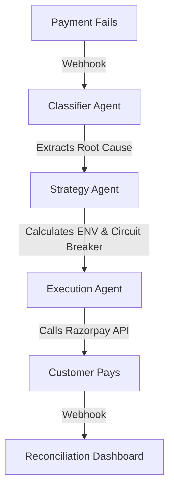

<div align="center">
  <h1>💸 Revenue Recovery Agent</h1>
  <p><b>An autonomous payment recovery engine that uses probability math and AI to rescue failed transactions—without blindly spamming users.</b></p>
</div>

---

## ⚡ What is this?
Payment failures cost businesses millions. The standard industry response is to blindly hammer the payment gateway with retries, which leads to chargebacks, frustrated users, and flagged merchant accounts.

**Revenue Recovery Agent** fixes this. It's a completely autonomous AI pipeline that analyzes *why* a payment failed and mathematically calculates the Expected Net Value (ENV) of different interventions. It only acts when the math says it should.

It's built with Node.js, Express, PostgreSQL, and integrates directly with the **Razorpay API** and **Gemini 2.5 Flash**.

## 🧠 How it works
The architecture is split into decoupled layers to ensure the AI doesn't hallucinate a financial strategy.



1. **Classifier**: When a payment fails, Gemini looks at the failure code, checkout stage, and context to determine the real root cause (e.g., `insufficient_funds`, `unrecoverable_fraud`, `transient_error`).
2. **Strategy Engine**: Runs the math. It calculates the recovery probability against the intervention cost. If a user abandoned checkout because of insufficient funds, a simple retry won't work. The engine might decide to send a 15% discount link instead.
3. **Safety Circuit Breaker**: If the daily intervention budget is hit, or if a transaction is flagged as fraud, the system hard-stops and escalates to a human. Zero exceptions.
4. **Execution**: Hits Razorpay's API to generate dynamic payment links and listens for webhooks to close the loop.

## 📊 The Dashboard
The project includes a real-time React (Vite) dashboard that gives you x-ray vision into the AI's brain.
- **Live KPI Tracking**: Revenue at risk, verified recovered revenue, and blocked transactions.
- **Intervention Analytics**: See exactly which strategies (Nudges vs. Discounts) are driving revenue.
- **Audit Log**: Every single decision the AI makes is logged to Postgres with its exact reasoning and expected value calculation.

## 🛠 Tech Stack
- **Backend**: Node.js, Express, TypeScript, Prisma (PostgreSQL)
- **Frontend**: React, Vite, Tailwind-inspired custom CSS
- **AI**: Gemini 2.5 Flash (via Google AI SDK)
- **Payments**: Razorpay API & Webhooks

## 🚀 Quickstart

1. **Clone & Install**
   ```bash
   npm install
   ```

2. **Environment Setup**
   Copy `.env.example` to `.env` and fill in your keys:
   - Razorpay test keys and webhook secret
   - Gemini API key
   - Postgres connection string
   - A secure random string for `ADMIN_API_SECRET`

3. **Database & Data**
   ```bash
   # Push schema to Postgres
   npx prisma db push
   
   # Seed the database with synthetic failed transactions
   npm run generate-data
   ```

4. **Run the Stack**
   ```bash
   # Terminal 1: Start the API server
   npm run api
   
   # Terminal 2: Start the dashboard
   cd dashboard && npm run dev
   ```

## 🛡️ Security
All mutative actions (overrides, webhook simulations) are protected by a Bearer token (`ADMIN_API_SECRET`). The dashboard automatically passes this from your environment. Do not deploy without setting this secret.

## 🧪 Evaluation & Proof
The engine isn't just winging it. We run the agent's decisions against an independent, decoupled ground-truth Monte Carlo simulation (`npm run evaluate`). 

In a 10,000 transaction simulation, the agent blocked 100% of risky/fraudulent retries that a naive retry-loop would have hit. It sacrificed top-line raw recovery volume to guarantee a 0% unnecessary retry rate, perfectly protecting the merchant's standing with gateways.
