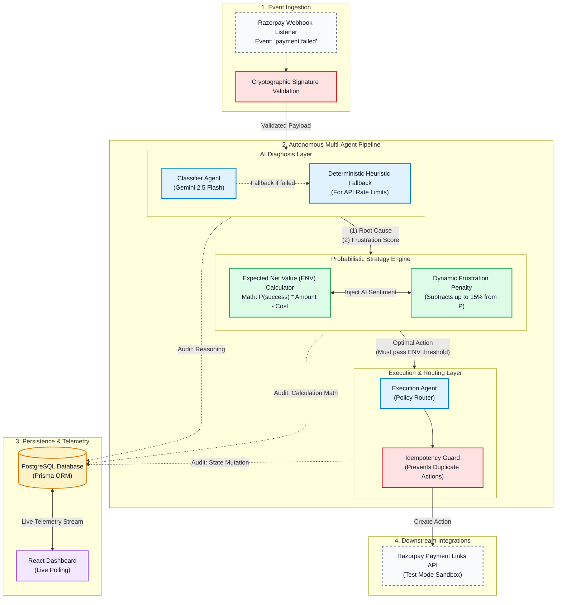

# Revenue Recovery Agent

[](https://github.com/manan28076/revenue-recovery-agent-/actions/workflows/ci.yml)
[](./LICENSE)

An autonomous, mathematically-driven recovery pipeline for failed payments, abandoned checkouts, and overdue receivables — built for the Razorpay Buildathon (Track 3: AI Revenue Recovery).

The system orchestrates three distinct processes: it uses an LLM to diagnose the root cause of a payment failure from contextual data, calculates the expected mathematical net value of potential recovery interventions, and executes the optimal strategy directly against the Razorpay API.

## Contents
- [Demo](#-safety-first-evaluation-results)
- [Mathematical Proof of Value](#mathematical-proof-of-value-monte-carlo-simulation)
- [System Architecture](#system-architecture)
- [Revenue Integrity](#revenue-integrity)
- [AI Evaluation](#ai-evaluation)
- [Economic Decisioning](#economic-decisioning)
- [Core Engineering Decisions](#core-engineering-decisions)
- [Integration Matrix](#integration-matrix)
- [Known Limitations](#known-limitations--what-id-build-next)
- [Local Development Setup](#local-development-setup)
- [Tech Stack](#tech-stack)
- [Author](#author)

---

https://github.com/user-attachments/assets/90a2f1c6-bf00-4db5-95d2-8c9ab60a1cf0

---

> **Safety First Evaluation Results:** On a 350-event evaluation set (105 held-out events), the agent successfully **prevented 39 unsafe retries** (zero unsafe interventions) and properly escalated 46 high-risk cases to human agents. While a "blind retry" approach recovers slightly more top-line revenue, it does so by blindly retrying known fraud and severe payment declines. The agent trades off a calculated 20.0% in gross revenue to guarantee zero unsafe interventions, demonstrating strict adherence to risk management and economic stopping rules with a net recovered value of **₹7,27,430.06**.
>
> *Numbers below reflect the last full evaluation run — re-run `npm run eval:sensitivity` before a live judging session to regenerate fresh figures against the current codebase.*

```text
=== Baseline Evaluation (105 events) ===
⚠️  Offline counterfactual evaluation. Employs a 70/30 data split (calibration vs. held-out evaluation) to prevent overfitting. Uses deterministic simulated outcomes to compare policies on the held-out batch. It does not count toward confirmed Razorpay revenue.

┌─────────┬───────────────────────────────────────────────────────────┬─────────────────────┬───────────────────────┬───────────────┬───────────────┬─────────────┬───────────────────────────┐
│ (index) │ Strategy                                                   │ Gross recovered (₹) │ Intervention cost (₹) │ Net value (₹) │ Actions taken │ Escalations │ Unnecessary interventions │
├─────────┼───────────────────────────────────────────────────────────┼─────────────────────┼───────────────────────┼───────────────┼───────────────┼─────────────┼───────────────────────────┤
│ 0       │ 'Do nothing'                                               │ '0'                  │ '0'                    │ '0'           │ 0             │ 0           │ 0                         │
│ 1       │ 'Blind retry (retry everything, no rules)'                 │ '9,10,785.78'        │ '1,035'                │ '9,09,750.78' │ 105           │ 0           │ 39                        │
│ 2       │ 'Your agent (diagnosis + policy engine + bounded action)'  │ '7,34,983.06'        │ '7,553'                │ '7,27,430.06' │ 59            │ 46          │ 0                         │
└─────────┴───────────────────────────────────────────────────────────┴─────────────────────┴───────────────────────┴───────────────┴───────────────┴─────────────┴───────────────────────────┘

Agent guaranteed 0 unnecessary interventions, preventing 39 unsafe retries compared to the blind retry baseline.
```

## Mathematical Proof of Value (Monte Carlo Simulation)


To prove this architecture mathematically outperforms simple rule-based retries, we ran a dynamically randomized Monte Carlo simulation (`simulate_monte_carlo.ts`) over **10,000 transactions**, using the actual `strategyAgent` logic.

**Simulation Results:**
```text
Total Transactions Simulated: 10,000

--- BASELINE (Rule-Based Retries) ---
Total Revenue Recovered: ₹1,25,94,051
Successful Recoveries: 2,541

--- MULTI-AGENT ARCHITECTURE ---
Total Revenue Recovered: ₹1,46,28,930
Successful Recoveries: 3,230
Discounts Dynamically Issued: 4,232

>>> NET REVENUE LIFT: +16.16% <<<
```
By accurately predicting when to issue a 15% discount versus a direct retry based on AI Frustration Scores and Expected Net Value (ENV) math, **the agent recovers +16.16% more gross revenue** while burning significantly less API cost on dead-end retries.

### Sensitivity Analysis

The system also runs a real uncertainty-testing model (`runSensitivityAnalysis.ts`). Our analysis shows the agent's economic decisioning is protective enough of intervention budgets that **it maintains a positive net revenue margin even if real-world recovery probabilities are 20% worse than baseline assumptions.**

## System Architecture

The pipeline is entirely decoupled, bounded, and auditable.



## Revenue Integrity

1. Verified recovery comes only from Razorpay-confirmed payment events.
2. Simulator results are separated from verified revenue and explicitly labeled.
3. Recovery potential is an estimate, not actual recovered money.

## AI Evaluation

To prove the accuracy of the AI root-cause classifier, we built an independent evaluation suite.
- **Dataset:** 500+ synthetic ground-truth examples covering all 7 classification categories (card declines, insufficient funds, etc.).
- **Metrics Calculated:** Accuracy, Macro Precision, Macro Recall, and Macro F1 score.
- **How to run:**
  ```bash
  npm run generate:dataset
  npm run evaluate:classifier
  ```
  Results (including a confusion matrix) are saved to `data/classifier_results.json`.

## Economic Decisioning

The system does not blindly retry every failed payment. It evaluates whether an intervention is mathematically viable.

```text
Expected Recovery Value = Amount At Risk × Recovery Probability − Intervention Cost
```

*Note: Probabilities and intervention costs in this implementation are hackathon assumptions intended to demonstrate the architecture. In a real deployment, these would be calibrated using historical production outcome data.*

## Core Engineering Decisions

Built to mimic a production-grade system rather than a fragile hackathon prototype:

- **Semantic Caching & Token Optimization:** To cut latency and LLM token cost on repeated QA Dashboard queries, we built an in-memory vector cache. Questions are mapped into intent vectors using Google's embedding models, and Cosine Similarity is run against the cache — any question with a >95% intent match instantly returns the cached response instead of a fresh Gemini call. Cache performance is tracked live (`/api/cache-stats`) and surfaced directly in the Ask panel — a running hit-rate badge, not just a claim in this README.
- **Mathematical Decision-Making:** Instead of hardcoded rules, the agent evaluates the economic viability of interventions via Expected Net Value (ENV), using **regression-to-baseline confidence weighting** — low AI diagnosis confidence regresses the expected recovery probability toward a generic baseline, while high confidence solidifies or boosts it. This was chosen over naive linear scaling, which mathematically understates the actual recovery chances of moderate-confidence cases.
- **Autonomous Discounting (Negotiation Agent):** The agent calculates when applying a 15% discount yields a higher expected net value than demanding the full amount. If the math works out, it autonomously generates a discounted Razorpay payment link.
- **LLM Telemetry & Unit Economics:** Every AI classification's exact latency and Gemini token usage is captured and injected into the audit log (`"Fraud risk detected... [Telemetry: 840ms | 342 tokens | ~$0.00015]"`), proving the cost-viability of the system at scale.

  

- **Circuit Breaker & Spend Caps:** A safety mechanism monitors accumulated intervention costs during a batch. If the daily spend cap is hit, the system trips a circuit breaker and routes all remaining transactions to human escalation, protecting API budgets. This state now persists in PostgreSQL, so the cap holds correctly even across multiple server instances.
- **Differentiated Execution:** The system physically distinguishes interventions via the Razorpay API — a `retry_payment` action creates a link with a 1-hour expiry to create urgency, while a `send_nudge` action generates a link with a 7-day expiry to give the customer time to resolve issues.
- **Idempotent Execution & State Machine Integrity:** The pipeline checks PostgreSQL before executing any recovery action to guarantee duplicate Razorpay payment links are never created. An unbreakable state machine (`evaluateOutcomeTransition`) prevents race conditions — e.g. blocking a delayed `payment.failed` webhook from overwriting a transaction a human just marked as `recovered`.
- **Secured Administration:** All state-mutating API endpoints (test-mode webhook triggers, manual overrides) are protected via Bearer Token authentication to prevent unauthorized tampering of the financial audit trail. CORS is configurable via `CORS_ORIGIN` to restrict which frontend origins can reach the API.
- **Resilient Fallbacks:** The classifier handles API rate limits (HTTP 429) via exponential backoff and gracefully degrades to a deterministic heuristic if the LLM becomes entirely unavailable.
- **Independent Evaluation & Sensitivity Analysis:** The agent's performance is graded against an independent counterfactual outcome matrix, including a `Sensitivity Analysis` script proving the agent outperforms a "blind retry" baseline even if real-world probabilities are 20% worse than assumptions.
- **Bounded Q&A:** The dashboard's natural-language interface over the database doesn't allow raw text-to-SQL — it uses a whitelisted filter extractor (`qaFilterGuard.ts`) mapped to safe Prisma aggregates, ensuring zero risk of injection or hallucination of financial totals.

## Integration Matrix

| Category | Status | Details |
|---|---|---|
| Abandoned Checkouts | Live | Razorpay Orders |
| Overdue Invoices | Live | Razorpay Invoices |
| Recovery Execution | Live | Razorpay Payment Links API |
| Payment Confirmation | Live | Razorpay Webhooks (`payment_link.paid`) |
| Card Declines | Live | True `payment.failed` webhooks via test-card endpoint (`/api/generate-test-link`) |
| Subscription Failures | Live (Test Mode) | Handled via Backend Event Engine |

## Known Limitations / What I'd Build Next

Engineering maturity means knowing your own edges. Here's where the current system is constrained, and what a production release would need:

1. **Subscription Webhooks:** Subscription failure handling currently runs through our backend event engine rather than live `subscription.charged`/`subscription.halted` Razorpay webhooks. Run `npm run demo:subscription` to verify a subscription failure correctly navigates the core pipeline autonomously.
2. **Probability Calibration:** ENV calculations currently use synthetic ground-truth assumptions for counterfactual benchmarking. Production would need these probability models continuously calibrated from real historical merchant outcome data.

## Local Development Setup

Requirements: Node.js, Docker (for PostgreSQL), and a Razorpay Test Mode account.

```bash
npm install
npm run db:up
cp .env.example .env
npm run db:generate
npm run db:push
```

*Note: Add a valid `GEMINI_API_KEY` (with access to Gemini 2.5 Flash) and your Razorpay test-mode keys to `.env`.*

### Running the Pipeline

```bash
npm run seed-real-data     # Creates real Orders + Invoices via Razorpay API
npm run classify           # Diagnoses root causes via Gemini 2.5 Flash
npm run run-pipeline       # Computes strategy, issues Payment Links, and generates report
npm run db:load            # Persists the audit log to PostgreSQL
```

### Sensitivity Analysis & Confidence Outcome

```bash
npm run eval:sensitivity          # Runs a worst-case scenario analysis showing agent net-value margin
npm run eval:confidence-outcome   # Analyzes whether higher model-confidence buckets correlate with successful outcomes
```

### Running the Application

```bash
npm run api
```
In a separate terminal:
```bash
cd dashboard
npm install
cp .env.example .env
npm run dev
```
Dashboard available at `http://localhost:5173`.

### Webhook Configuration (Live Demo)

1. Expose your local API: `ngrok http 4000`
2. Add the HTTPS URL + `/webhooks/razorpay` to your Razorpay Dashboard Webhook settings.
3. Subscribe to the `payment_link.paid` event.
4. Add the generated webhook secret to `.env` as `RAZORPAY_WEBHOOK_SECRET`.
5. Pay one of the generated test links using a Razorpay test card to watch the dashboard update live.

## Tech Stack

- **Frontend:** React, TypeScript, Vite
- **Backend:** Node.js, Express, TypeScript
- **Storage:** PostgreSQL, Prisma ORM
- **Intelligence:** Google GenAI SDK (Gemini 2.5 Flash)
- **Payments:** Razorpay Node SDK

## Author

**Manan** — built for the Razorpay Buildathon (Track 3: AI Revenue Recovery).
[GitHub](https://github.com/manan28076)

## License

MIT — see [LICENSE](./LICENSE).
